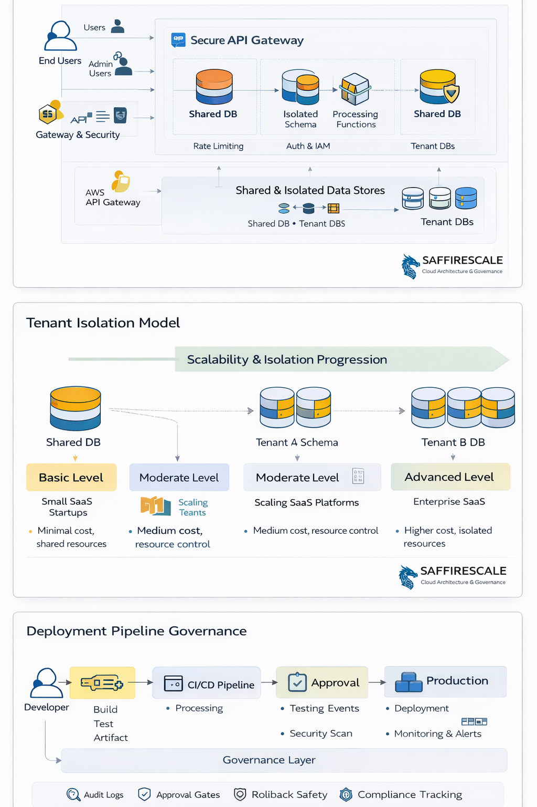

# Enterprise Multi-Tenant SaaS Architecture — Governance Model

## Overview

This repository presents a governance-first cloud architecture designed for scalable multi-tenant SaaS platforms operating in production or regulated environments.

The architecture focuses on predictable scaling, tenant isolation maturity, deployment safety, and operational resilience — enabling organizations to grow without infrastructure re-architecture.

---

## Architecture Visual Overview

The diagrams illustrate:

1. System architecture flow from users to observability
2. Tenant isolation maturity progression model
3. Deployment pipeline governance with approval controls

---

## Problem Context

Many SaaS platforms encounter architectural risks as they scale:

- Tenant isolation boundaries become unclear
- Deployments introduce instability or downtime
- Infrastructure grows without governance controls
- Enterprise customers require security and compliance assurances
- Disaster recovery is not formally modeled
- Costs increase without visibility

This reference architecture addresses these challenges through structured system design.

---

## Architecture Objectives

- Multi-tenant scalability with isolation escalation capability
- Deployment governance and zero-downtime release safety
- High availability and resilience across environments
- Observability and operational predictability
- Security boundaries aligned with enterprise requirements
- Cost visibility and growth planning

---

## High-Level Architecture Components

- Tenant-aware application services
- API gateway and service orchestration layer
- Shared and isolated data patterns
- CI/CD governance and release control
- Monitoring and observability stack
- Disaster recovery strategy
- Infrastructure automation foundation

---

## Who This Architecture Is For

This model is suitable for organizations:

- Building or scaling SaaS platforms
- Preparing for enterprise onboarding
- Operating in FinTech / regulated domains
- Modernizing legacy infrastructure
- Seeking predictable production reliability
- Preparing for compliance or security audits

---

## Key Design Principles

- Governance before automation
- Isolation maturity progression (shared → segmented → dedicated)
- Deployment safety over deployment speed
- Failure-mode awareness and recovery readiness
- Infrastructure clarity and documentation discipline

---

## Example Use Cases

- Multi-tenant B2B SaaS platforms
- Embedded finance systems
- Marketplace platforms
- Enterprise workflow automation systems
- Regulated cloud applications

---

## Engagement Outcomes (If Implemented)

Organizations implementing this architecture typically achieve:

- Reduced production risk
- Predictable scaling capability
- Improved deployment reliability
- Stronger tenant data protection
- Clear infrastructure evolution roadmap
- Enterprise customer confidence

---

## Repository Contents

- Architecture diagrams
- Governance models
- Deployment strategy references
- Infrastructure patterns
- Supporting documentation

---

## About SaffireScale

SaffireScale is an enterprise cloud architecture practice focused on multi-tenant SaaS and embedded finance platforms.

We specialize in governance-first system design that enables organizations to scale confidently without operational chaos.

---

## Architecture & Consulting Engagements

If you are building or scaling a SaaS platform and need structured architecture guidance, feel free to connect.
